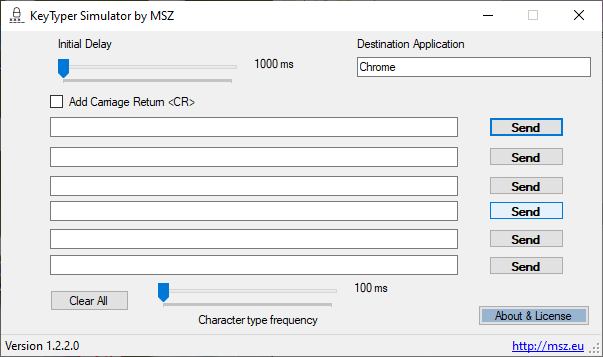

# KeyTyper Simulator

&nbsp;

May thanks to <a href="https://www.jetbrains.com/?from=KeyTyperSimulator">JetBrains</a> for giving us the <b>Open Source License</b> for free with the full access to their developer suite.
## PROGRAM NAME     
  **KeyTyper Simulator**
## VERSION 

  **1.2.3.4**

## DESCRIPTION
  **KeyTyper Simulator** switches to the indicated process and simulate typing a sequence of 
  characters as when they are typed using the keyboard with a selectable frequency.

## REQUIREMENTS
  To run the program you need **Microsoft .NET Framework 4.8**
	Source code was written using **Microsoft Visual Studio 2019**
	
## COPYRIGHT & LICENSE
  Copyright(C) 2020-2021  Marco S. Zuppone - msz@msz.eu - https://msz.eu

  This program is free software: you can redistribute it and/or modify
  it under the terms of the GNU Affero General Public License as
  published by the Free Software Foundation, either version 3 of the
  License, or any later version.

  This program is distributed in the hope that it will be useful,
   but WITHOUT ANY WARRANTY; without even the implied warranty of
   MERCHANTABILITY or FITNESS FOR A PARTICULAR PURPOSE. See the
   GNU Affero General Public License for more details.
   
   All the details on the license are available online 
   here https://www.gnu.org/licenses/agpl-3.0.en.html or in the 
   file COPYING.TXT included in this distribution. 

Thanks to Juan Gomez for the picture (from https://UNSPLASH.COM)
